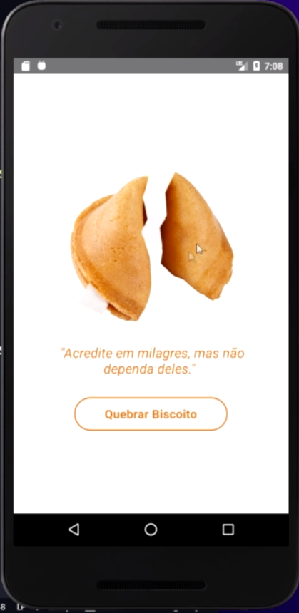
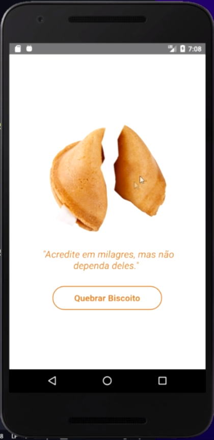

# Biscoitos da Sorte

## Descrição
O aplicativo "Biscoitos da Sorte" é uma ferramenta divertida e inspiradora que oferece mensagens motivacionais e reflexivas, semelhantes às encontradas nos biscoitos da sorte tradicionais. Com uma ampla variedade de frases encorajadoras, este aplicativo é perfeito para começar o dia com uma dose de positividade ou para buscar inspiração ao longo do dia.

## Funcionalidades

- **Frases Inspiradoras**: Receba mensagens motivacionais e reflexivas aleatórias a cada vez que abrir o aplicativo.
- **Compartilhamento**: Compartilhe suas frases favoritas com amigos e familiares através das redes sociais ou aplicativos de mensagens.
- **Interface Simples**: Uma interface limpa e intuitiva para uma experiência de usuário agradável.

## Instalação

1. Clone o repositório do aplicativo para o seu ambiente local.

## Como Usar

1. Abra o aplicativo "Biscoitos da Sorte".
2. Clique no botão "Quebrar biscoito" para receber uma nova frase inspiradora.
3. Repita o processo para receber mais mensagens motivacionais ao longo do dia.

