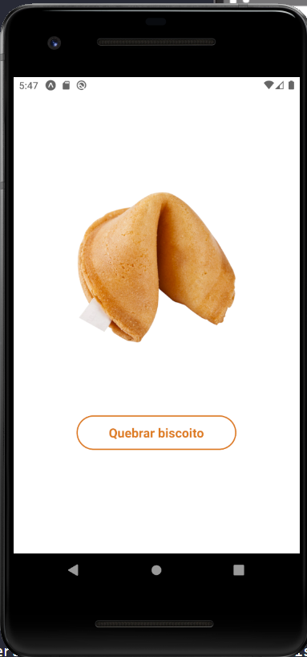

# Biscoitos da Sorte

## Descrição
O aplicativo "Biscoitos da Sorte" é uma ferramenta divertida e inspiradora que oferece mensagens motivacionais e reflexivas, semelhantes às encontradas nos biscoitos da sorte tradicionais. Com uma ampla variedade de frases encorajadoras, este aplicativo é perfeito para começar o dia com uma dose de positividade ou para buscar inspiração ao longo do dia.

## Funcionalidades

- **Quebrar biscoito**: Retorna uma mensagem aleatória.

## Instalação

1. Certifique-se de ter o ambiente de desenvolvimento React Native configurado em sua máquina.
2. Clone o repositório do aplicativo para o seu ambiente local.
3. Execute o comando `npm install` para instalar as dependências.
4. Execute o aplicativo em um emulador ou dispositivo usando o comando `npx react-native run-android` ou `npx react-native run-ios`, dependendo da plataforma alvo.

## Como Usar

1. Abra o aplicativo "Biscoitos da Sorte".
2. Clique no botão "Quebrar biscoito" para receber uma nova frase inspiradora.
3. Repita o processo para receber mais mensagens motivacionais ao longo do dia.

